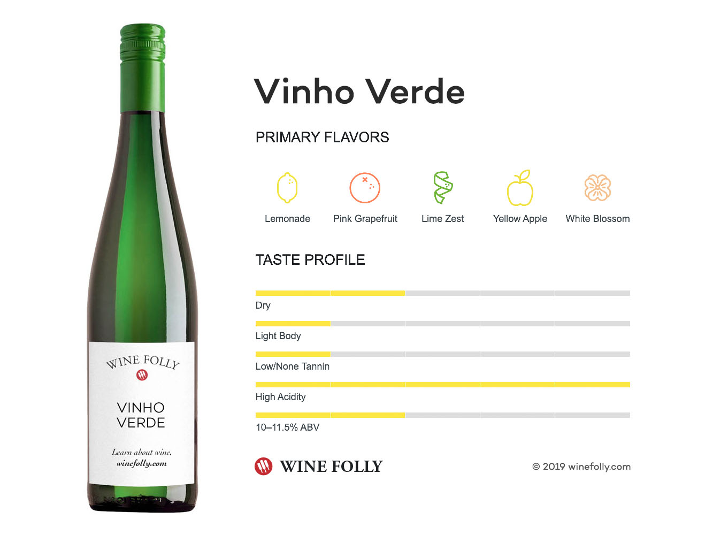

## Group Members

Darren Yap Yee Shern (21001235) <br> Nur' Aliah Syamimi Binti Muhammad Sazali (21081765)<br> Chong Kai Yuan (21081609) <br> Ethan Lee Jia Hua (21089750) <br> Daniel Chin Wei Jian (20095204) <br> Harreesh Dev Chandrasager (20083200)

<br>

## Introduction

Wine quality assessment is an important factor in the wine industry and the ability to predict the quality based on various chemical properties can enhance decision making processes in viticulture. In fact, chemical analysis of wine has been a well-established method for determining its quality; factors its acidity, sugar content and alcohol levels has been known to affect taste and overall consumer satisfaction.

### Problem Statement:

**Determining Key Physicochemical Factors Influencing Wine Quality:**

Identify and quantify the impact of different physicochemical properties on the quality ratings of white Vinho Verde wines. Create a regression model that highlights the most significant factors contributing to wine quality.

## Data Processing

```{r message=FALSE, warning=FALSE, include=FALSE}

library(tidyr)
library(dplyr)
library(MASS)
library(GGally)

library(ggplot2)
library(ggThemeAssist)
library(esquisse)

library(tidyverse)
library(olsrr)
library(AICcmodavg)
library(leaps)
library(corrplot)
library(car)
library(pastecs)
library(rmdformats)

```

## Dataset Description: Name

The dataset provided is considered for *vinho verde*, a unique product from Minho from the northwest region in Portugal and was collected from May (2004) to February (2007). Note that both red and white wine datasets were available, but the white wine dataset was chosen for analysis and the red wine dataset was used to validate and verify results.



Variables Involved under considered dataset:

1.  Sulphates (g(potassium sulphate)/dm^3^)
2.  Chlorides (g(sodium chloride)/dm^3^)
3.  Volatile acidity (g(acetic acid)/dm^3^)
4.  Fixed acidity (g(tartaric acid)/dm^3^)
5.  Total sulfur dioxide (mg/dm^3^)
6.  Free sulfur dioxide (mg/dm^3^)
7.  Residual sugar (g/dm^3^)
8.  Citric acid (g/dm^3^)
9.  Density (g/cm^3^)
10. Alcohol (vol.%)
11. pH level
12. Quality

This Dataset consists of 4898 observations based on 12 variables

Data source: [Wine Quality Dataset](https://www.semanticscholar.org/paper/Modeling-wine-preferences-by-data-mining-from-Cortez-Cerdeira/bf15a0ccc14ac1deb5cea570c870389c16be019c)

```{r}
#getwd()
Dataset<-read.csv("winequality-white.csv", sep =";")
str(Dataset)
```

## Descriptive Statistics

```{r}
#To display the descriptive statistics of our chosen dataset.
round(stat.desc(Dataset),2)

ggplot(Dataset, aes(x = quality)) + 
  geom_bar() + 
  xlab("Wine Quality") + 
  ylab("Frequency") + 
  ggtitle("Distribution of Wine Quality") + theme(axis.title = element_text(family = "serif",
    size = 14, face = "bold"), axis.text = element_text(size = 13),
    plot.title = element_text(family = "serif",
        size = 14, face = "bold.italic"),
    panel.background = element_rect(fill = "white"),
    plot.background = element_rect(fill = "cornsilk",
        colour = "aliceblue"))

```

## Fitting Full Model

```{r}

# Full model fitting

fullmodel<-lm(quality~.,data=Dataset)
summary(fullmodel)

# Initial preliminary values

fullmodel_aic <- AIC(fullmodel)
fullmodel_bic <- BIC(fullmodel)

fullmodel_aic
fullmodel_bic

```

**INTERPRETATION**

1)  Residual inspection : Residuals of the full model do appear to be symmetrically distributed around 0, which is ideal

2)  Coefficient inspection : by looking at the associated p-values for the t-test, we can identify whether the coefficient is significantly different zero. In this context, 3 variables stand out with having a p-value \>0.05, that being Citric Acid, Chlorides and Total Sulfur Dioxide.

3)  Residual standard error: value should be as minimal as possible to indicate a better model fitted; under the full model it is 0.7514

4)  Multiple R-squared: value should be as high as possible to indicate how well the model performs in explaining variability of the data observations; under the full model it is 0.2819

## Investigating Influence

```{r}
#studentized residuals ( >3 may be potential outlier)

studentized_residuals_fullmodel<-studres(fullmodel)
plot(studentized_residuals_fullmodel)
residual_threshold=3

# cooks distance (points>1 considered influential)

cd_fullmodel<-cooks.distance(fullmodel)
plot(cd_fullmodel, main="Cook's distance visualization", ylab="cooks distance")
abline(h = 4/(nrow(Dataset)-length(coef(fullmodel))), col = "red")
cd_threshold=4/nrow(Dataset)


# hat values, to investigate leverage

hatvalues_fullmodel<-hatvalues(fullmodel)
plot(hatvalues_fullmodel)
abline(h= 2 * (length(fullmodel$coefficients)) / nrow(Dataset),col ="red")
leverage_threshold=2*(length(fullmodel$coefficients)) / nrow(Dataset)


#all flagged points that need to be removed

high_studentized_residual_points<-which(studentized_residuals_fullmodel>residual_threshold)
high_leverage_points<-which(hatvalues_fullmodel>leverage_threshold)

high_cooks_distance_points<-which(cd_fullmodel>cd_threshold)

all_potential_issues=unique(c(high_studentized_residual_points,high_leverage_points,high_cooks_distance_points))

updated_Dataset<-Dataset[-all_potential_issues, ]
updated_fullmodel <- lm(quality ~ ., data = updated_Dataset)
updated_fullmodel

```

**FITTING THE UPDATED FULL MODEL**

```{r}
str(updated_Dataset)
round(stat.desc(updated_Dataset),2)

glm_updated_full = glm(quality ~., data= updated_Dataset)

glm_updated_full

```

## Investigating Correlation

```{r}

#Investigating multicollinearity and correlation 

correlation_matrix<-round(cor(updated_Dataset),2) 
correlation_matrix

corrplot::corrplot(correlation_matrix)

# investigating correlation between highlighted x variables

```

**INTERPRETATION**

We can separate the interpretation into 2 parts:

1)  First, the *y* variable with the other *x* variables:

By referring to the last row under the correlation plot, we can identify the correlation between the dependent variable against all 11 other independent variables under this dataset. We notice out of all variables, there are two variables that stand out in terms of being correlated with *y* (quality), that being alcohol (vol.%) and also density (g/cm^3^). The exact correlation values are 0.49 and -0.36 respectively and a higher value means a stronger linear relationship, making x a potentially valuable predictor of y. However, we need to always consider multicollinearity to ensure the robustness of your regression model. Thus we move to the second part of the interpretation.

2)  the *x* variables with each other (multicolinearity)

By referring to the upper or lower non-diagonal entries under the correlation plot, it reveals very little correlation between the x variables, some of them are even orthogonal (no linear relationship between the regressors) indicating that muticollinearity is minimal under this dataset. This means that it is likely each predictor provides unique and useful information in predicting the dependent variable. However, there are two exceptions:

-   Alcohol & Density : correlation value of -0.82

-   Density & Residual sugar : correlation value of 0.84

<br>

```{r}

# Investigate multicollinearity under full model

vif_updated_full_model<-vif(updated_fullmodel)
vif_updated_full_model

# presence of VIF values more than 10 indicate that the full model is not good----------------------------------- compare with our best regression model later
```

## Fitting Simple Linear Model

```{r}

SLR<-lm(quality~alcohol,data=updated_Dataset)

summary(SLR)
round(summary(SLR)$adj.r.squared,4) # 0.2388
round(summary(SLR)$sigma,4) #0.6936

residuals_SLR<-residuals(SLR)
RSS_SLR<-sum(residuals_SLR^2)
RSS_SLR #2149.739


```

<br>

## Fitting Multiple Linear Regression

```{r}

#MLR_x_y 
# x is the number of variables being fitted
# y is the index of the model
MLR_2_1<-SLR<-lm(quality~alcohol+fixed.acidity,data=updated_Dataset)
MLR_2_2<-SLR<-lm(quality~alcohol+volatile.acidity,data=updated_Dataset)
MLR_2_3<-SLR<-lm(quality~alcohol+citric.acid,data=updated_Dataset)
MLR_2_4<-SLR<-lm(quality~alcohol+residual.sugar,data=updated_Dataset)
MLR_2_5<-SLR<-lm(quality~alcohol+chlorides,data=updated_Dataset)
MLR_2_6<-SLR<-lm(quality~alcohol+free.sulfur.dioxide,data=updated_Dataset)
MLR_2_7<-SLR<-lm(quality~alcohol+total.sulfur.dioxide,data=updated_Dataset)
MLR_2_8<-SLR<-lm(quality~alcohol+density,data=updated_Dataset)
MLR_2_9<-SLR<-lm(quality~alcohol+pH,data=updated_Dataset)
MLR_2_10<-SLR<-lm(quality~alcohol+sulphates,data=updated_Dataset)


residuals_MLR_2_1<-residuals(MLR_2_1)
RSS_MLR_2_1<-sum(residuals_MLR_2_1^2)
RSS_MLR_2_1

residuals_MLR_2_2<-residuals(MLR_2_2)
RSS_MLR_2_2<-sum(residuals_MLR_2_2^2)
RSS_MLR_2_2 

residuals_MLR_2_3<-residuals(MLR_2_3)
RSS_MLR_2_3<-sum(residuals_MLR_2_3^2)
RSS_MLR_2_3

residuals_MLR_2_4<-residuals(MLR_2_4)
RSS_MLR_2_4<-sum(residuals_MLR_2_4^2)
RSS_MLR_2_4

residuals_MLR_2_5<-residuals(MLR_2_5)
RSS_MLR_2_5<-sum(residuals_MLR_2_5^2)
RSS_MLR_2_5

residuals_MLR_2_6<-residuals(MLR_2_6)
RSS_MLR_2_6<-sum(residuals_MLR_2_6^2)
RSS_MLR_2_6

residuals_MLR_2_7<-residuals(MLR_2_7)
RSS_MLR_2_7<-sum(residuals_MLR_2_7^2)
RSS_MLR_2_7

residuals_MLR_2_8<-residuals(MLR_2_8)
RSS_MLR_2_8<-sum(residuals_MLR_2_8^2)
RSS_MLR_2_8

residuals_MLR_2_9<-residuals(MLR_2_9)
RSS_MLR_2_9<-sum(residuals_MLR_2_9^2)
RSS_MLR_2_9

residuals_MLR_2_10<-residuals(MLR_2_10)
RSS_MLR_2_10<-sum(residuals_MLR_2_10^2)
RSS_MLR_2_10


```

```{r}

# MLR_2_2 has smallest RSS, so the next variable should be added is volatile.acidity

summary(MLR_2_2)


round(summary(MLR_2_2)$adj.r.squared,4) # 0.281, slr was 0.2388
round(summary(MLR_2_2)$sigma,4) # 0.6741, slr was 0.6936

#RSS for MLR_2_2 is 2030, SLR was 2149

# so by comparison the MLR is better model when comparing all the values
# now need to repeat steps by adding one new variable to this existing model consisting of alcohol and volatile acidity

#now can investigate multicollinearity also

vif_MLR_2_2<-vif(MLR_2_2)
vif_MLR_2_2 #both variables are less than 5, so can proceed as scheduled


```

```{r, results = "hold"}
cortable = as.data.frame(cor(updated_Dataset))
cortablefiltered = subset(cortable, select = quality) 
numbering = seq(12)
names = names(cortable)

data1 = data.frame(cortablefiltered, numbering, names)
data1 = data1[-12,]
data1$quality = abs(data1$quality)

pairs = c(NULL)
naming = names[-12]
naming = naming[-11]
nametest = naming

a = 12
b= 10

for (i in 1:a) {
  pvalue = c(NULL)
  AIC = c(NULL)
  count = c(NULL)
  stop = FALSE
  
  framefull = data1 %>% arrange(desc(quality))
  pairs[1] = framefull[1,3]
  cat("\nquality ~", pairs[i], "+ \n")
  
  for (j in 1:b) {
    formula = as.formula(paste("quality ~",pairs[i]," + ", nametest[j]))
    pvalue[j] = (summary(lm(formula, data = updated_Dataset))$coefficients)[i+2,4]
    AIC[j] = summary(glm(formula, data = updated_Dataset))$aic
    cat("\n\n")
    print(summary(lm(formula, data = updated_Dataset))$coefficients)
    count[j] = j
  }
  
  framefull2 = data.frame(pvalue, nametest, count)
  framefull2 = framefull2 %>% arrange(pvalue)
  nametest = nametest[-framefull2[1,3]]

  pairs[i+1] = paste(c(pairs[i], framefull2[1,2]), collapse = " + ") 
  b = b - 1
  cat("\n", i," iteration done\n")
  
  cat("\nCurrent AIC: ", summary(glm(as.formula(paste("quality ~",pairs[i])), data = updated_Dataset))$aic, "\n\n")
  
  print(AIC)
  
  cat("\nP-values for each of next variables\n")
  print(pvalue)
  print("==========================================================")
  
  if (pvalue[framefull2[1,3]]>0.05){
    stop = TRUE
    formula2 = paste("quality ~", pairs[i])
    print(summary(glm(formula2, data = updated_Dataset)))
    break
  }
  if (stop){break}
}
```

```{r}
glm_multi1 = glm(quality ~ 
                  alcohol + volatile.acidity + residual.sugar + free.sulfur.dioxide + pH + density + sulphates + fixed.acidity + chlorides, 
                data = updated_Dataset)

car::vif(
  mod = glm_multi
) %>%
  sort()

glm_multi2 = glm(quality ~ 
                  alcohol + volatile.acidity + residual.sugar + free.sulfur.dioxide + pH + sulphates + fixed.acidity + chlorides, 
                data = updated_Dataset)

car::vif(
  mod = glm_multi2
) %>%
  sort()
```


